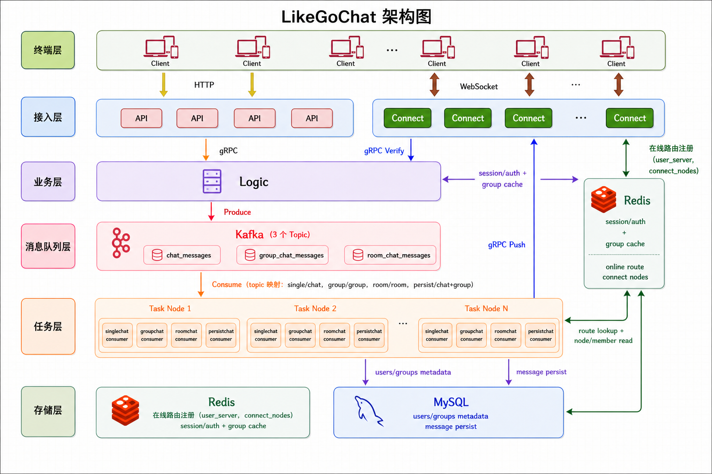

## 项目介绍

LikeGoChat 是一个参考[LockGit/gochat](https://github.com/LockGit/gochat)分层思路实现的分布式即时通讯系统，面向高并发在线聊天场景，支持单聊、小群聊与聊天室广播三类核心消息模型。

项目采用 `API + Logic + Task + Connect` 四层架构：

- `API`：HTTP接入层，负责请求解析、会话校验与参数组装。
- `Logic`：核心业务层，负责认证/会话管理、群成员鉴权、消息ID生成与Kafka生产。
- `Task`：异步消费层，负责消费Kafka消息，进行在线路由、批量下发与离线持久化。
- `Connect`：长连接网关层，负责WebSocket连接管理、心跳保活、消息推送。

依赖组件：

- `Kafka`：解耦消息生产与投递，承载单聊/群聊/房间广播/持久化消费链路。
- `Redis`：维护会话状态、用户在线路由（`user_server:*`）、群成员缓存（`group_members:*`）、Connect节点注册等。
- `MySQL`：存储用户、群组、群成员及消息数据，作为缓存回源与离线消息持久化基础。

核心功能：

1. 用户注册、登录、会话校验与单端登录（Lua原子切换`user->session`/`session->user`）。
2. WebSocket长连接接入，支持心跳检测、慢连接保护、连接替换、连接断开处理。
3. 消息传播链路`HTTP -> Logic -> Kafka -> Task -> Connect -> WebSocket`。
4. 小群聊天：成员鉴权、群成员缓存、singleflight 回源收敛、按节点批量推送。
5. 聊天室广播：用户动态加入/退出房间，Task 层广播至所有 Connect 节点后本地 fanout。
6. 离线消息持久化与幂等写入（唯一键 + `OnConflict DoNothing`）。
7. Connect节点横向扩展，支持多节点实时推送。

---

登录机制：
基于session机制实现，在服务器端维护用户的登录状态，实际上是在redis中存储一个双索引：
session-userID和userID-session，前者用于验证用户的登录状态/权限等鉴权操作，而后者用于处理登录/登出/单端挤占等操作。
在登录时：lua脚本实现撤销旧登录状态，覆盖新登录状态。
登出是：lua脚本实现撤销当前登录状态，因为登录会直接覆盖登录状态，所以登出时需要检查当前session状态是否被覆盖。

1、/api/login登录拿到sessionID
2、用sessionID去连接ws，并将userID-connect_serverID添加到redis中

群聊机制：

1、小群聊天
本质单人聊天广播：需要task层查到所有人连接的connect节点并进行推送

2、聊天室功能：roomID唯一键
ws连接到connect节点时，显式传roomID进行连接，在当前connect层bucket内注册
发送消息：调logic层grpc，推送Kafka，task层处理广播到所有connect节点

消息离线机制：
每类消息单独一个consumer group来做持久化

v2功能：
1、安全问题：
登录验证、SSL、跨越安全问题
2、更多功能：
离线消息推送、文件上传/下载、多媒体(语音聊天...)、...
已读回执、连接迁移、

redis和数据库的一致性如何保证：最终一致 + 防脏读策略
写库删缓存 + 双删 + 回源重建 + singleflight + TTL

对于singleflight机制，每个logic节点的同一groupid回源是收敛的，而每个task层节点调用logic的请求是收敛的，因此对于MySQL来说，一个group的并发请求最多是N+1,N为logic层节点个数。

